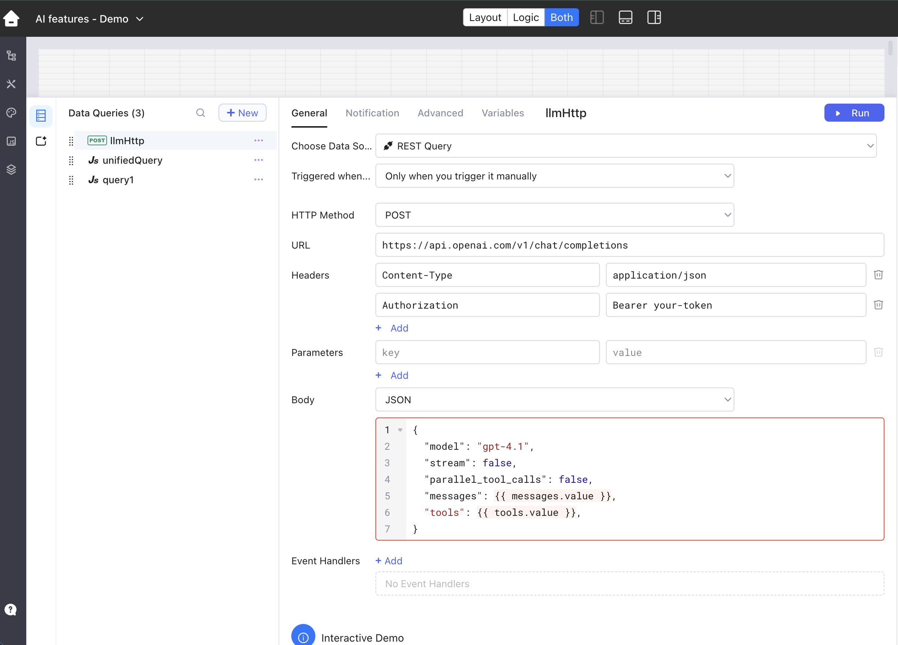
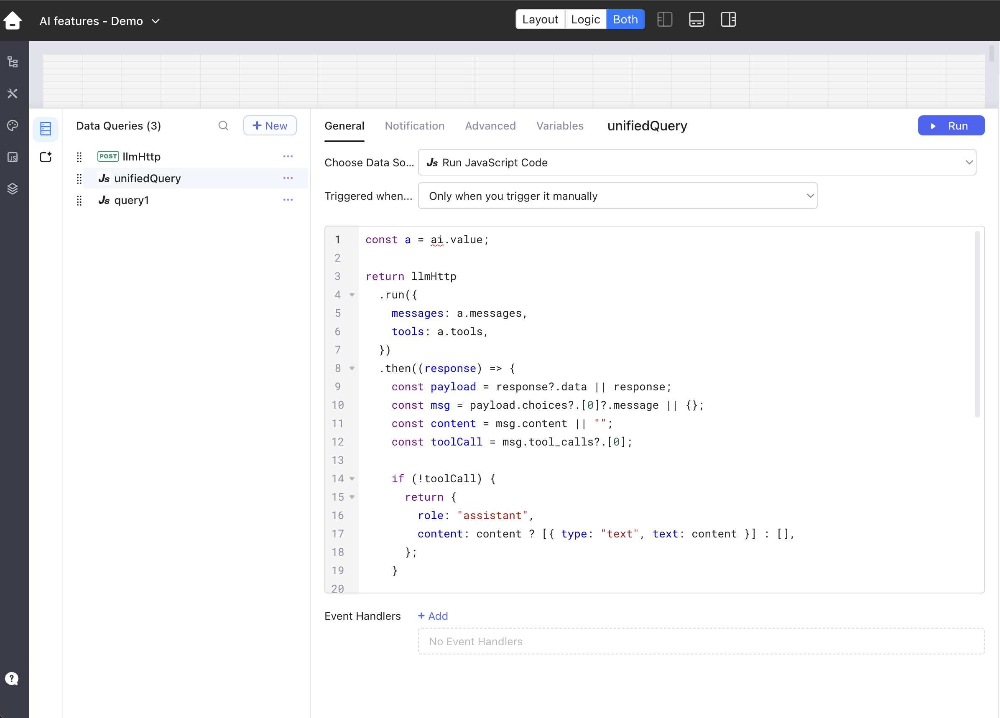
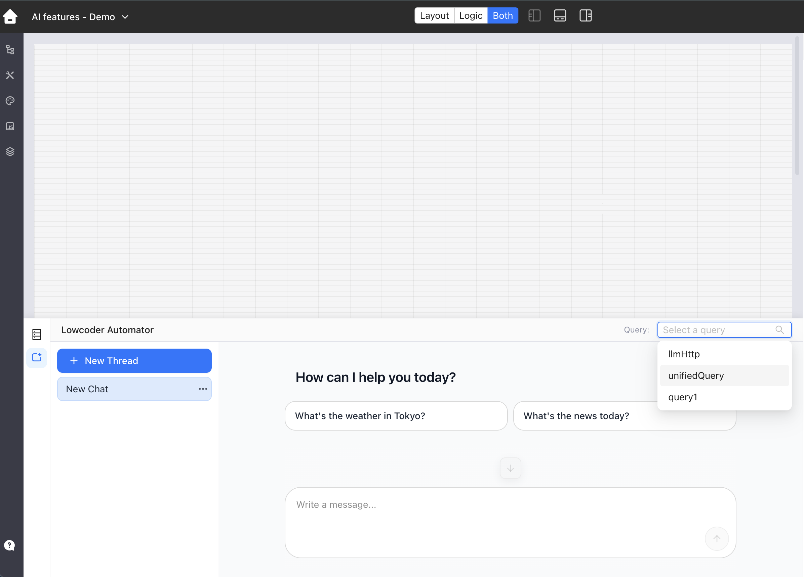
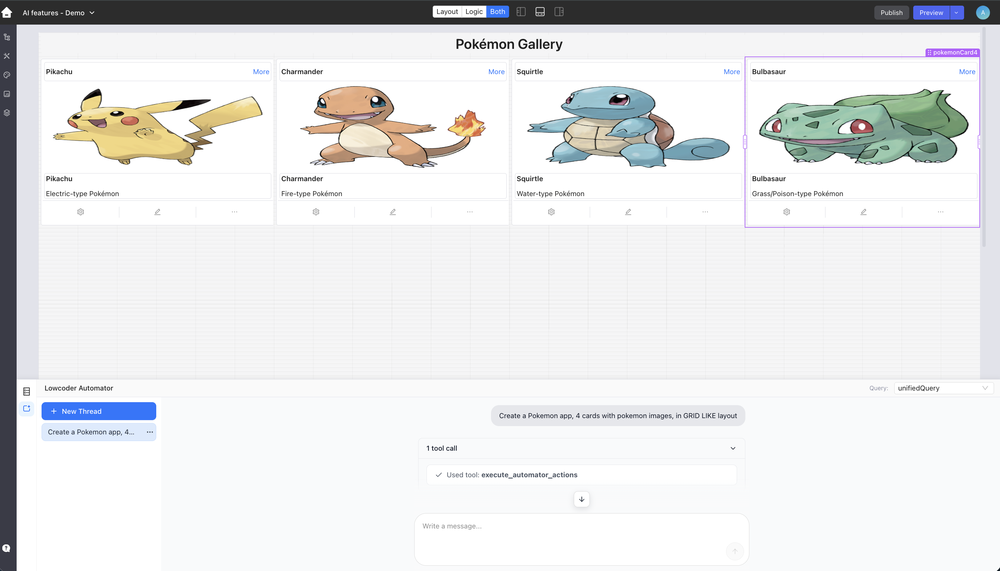

# Automator

Lowcoder Automator is an AI-assisted editor feature for creating and changing parts of an app from natural language instructions.

Automator is a subscription feature. When it is enabled for your workspace, it appears in the App Editor and lets you select the Lowcoder query that should handle AI requests.

## Bring Your Own Model

Lowcoder does not require a specific AI model for Automator.

You can use any model or provider of your choice, for example OpenAI-compatible APIs, self-hosted models, private gateways, or other LLM services. The selected Lowcoder query is responsible for sending Automator's request to your model and converting the model response back into the message format Lowcoder expects.

This keeps the model, API key, endpoint, and provider configuration under your control.

For Automator, choose a model that supports tool or function calling. Automator can still show a normal text reply without tool calls, but app changes are applied only when the model returns the Automator tool call.

Examples of possible providers include:

- OpenAI or any OpenAI-compatible API
- xAI Grok through an OpenAI-compatible chat completions endpoint
- Ollama with a local model that supports tools
- Anthropic Claude through a small adapter in the JavaScript bridge query
- your own backend that accepts Lowcoder's `messages` and `tools` and returns the assistant message shape

## How Automator Works

At runtime, Automator builds an AI payload from the current editor state and conversation. It passes this payload to the selected query as:

```js
{{ ai.value }}
```

The payload contains:

```js
{
  mode: "automator",
  messages: [...],
  tools: [...]
}
```

The query should send `messages` and `tools` to your model. If the model returns a normal assistant reply, the query returns that text to Automator. If the model calls an Automator tool, the query returns the tool call so Lowcoder can apply the generated actions in the editor.

Automator does not call the model directly. The selected query is the integration layer between Lowcoder and your AI provider.

## Recommended Query Setup

A common setup is to create two queries:

1. an HTTP query that calls your model provider
2. a JavaScript query that acts as the bridge between Automator and the HTTP query

The JavaScript query is the one you select in the Automator panel.

This pattern is useful because the Automator UI does not need to know which model provider you use. The HTTP query handles the provider call. The JavaScript bridge normalizes the provider response for Lowcoder.

Before you start, prepare:

- a model endpoint
- any required API key or authentication headers
- a model name
- a Lowcoder HTTP query, for example `llmHttp`
- a Lowcoder JavaScript query, for example `aiBridge`

In the example below, the HTTP query is named `llmHttp` and the JavaScript bridge query is named `unifiedQuery`.

## HTTP Query

Create an HTTP query, for example `llmHttp`, that points to your model provider endpoint.

For an OpenAI-compatible chat completions API, the request body can look like this:

```json
{
  "model": "gpt-4.1",
  "stream": false,
  "parallel_tool_calls": false,
  "messages": {{ messages.value }},
  "tools": {{ tools.value }}
}
```

Change the model name, URL, headers, authentication, and request fields to match the provider you use.

<figure><figcaption><p>HTTP query calling an OpenAI-compatible model endpoint.</p></figcaption></figure>

## Provider Starting Points

Many providers can use the same HTTP body when they support the OpenAI chat completions format.

### OpenAI-Compatible APIs

Use this style for OpenAI and other providers that expose a compatible `/chat/completions` endpoint:

```json
{
  "model": "your-model-name",
  "stream": false,
  "parallel_tool_calls": false,
  "messages": {{ messages.value }},
  "tools": {{ tools.value }}
}
```

The JavaScript bridge above can usually stay the same because the response is expected at:

```js
payload.choices?.[0]?.message
```

### Grok

Grok can be used in the same way when you call an OpenAI-compatible xAI chat completions endpoint.

Use your xAI endpoint and API key in the HTTP query, then set the model to the Grok model you want to use:

```json
{
  "model": "grok-...",
  "stream": false,
  "messages": {{ messages.value }},
  "tools": {{ tools.value }}
}
```

If the response follows the OpenAI-compatible shape, no change is needed in the JavaScript bridge.

### Ollama

Ollama can also be used when your Lowcoder instance can reach the Ollama server and the selected local model supports tools.

For a local setup, the HTTP query usually points to an Ollama OpenAI-compatible endpoint such as:

```text
http://localhost:11434/v1/chat/completions
```

Then use a local model name:

```json
{
  "model": "llama3.1",
  "stream": false,
  "messages": {{ messages.value }},
  "tools": {{ tools.value }}
}
```

In hosted or containerized Lowcoder environments, `localhost` means the Lowcoder container or server, not your laptop. Use a reachable network hostname for Ollama in that case.

### Claude

Claude can be used too, but it does not use the exact same request and response shape as OpenAI-compatible APIs. Keep the same Automator payload, but adapt it in the JavaScript bridge.

For Claude, the bridge usually needs to:

- move the system message into Claude's top-level `system` field
- convert OpenAI-style tools into Claude tools
- read Claude `text` and `tool_use` response blocks
- return Lowcoder's assistant message shape

A simplified bridge shape looks like this:

```js
const a = ai.value;
const system = a.messages.find((m) => m.role === "system")?.content || "";
const messages = a.messages.filter((m) => m.role !== "system");
const tools = a.tools.map((tool) => ({
  name: tool.function.name,
  description: tool.function.description,
  input_schema: tool.function.parameters,
}));

return claudeHttp
  .run({ system, messages, tools })
  .then((response) => {
    const payload = response?.data || response;
    const blocks = payload.content || [];
    const text = blocks
      .filter((block) => block.type === "text")
      .map((block) => block.text)
      .join("\n");
    const toolUse = blocks.find((block) => block.type === "tool_use");

    if (!toolUse) {
      return {
        role: "assistant",
        content: text ? [{ type: "text", text }] : [],
      };
    }

    const argsText = JSON.stringify(toolUse.input || {});

    return {
      role: "assistant",
      content: [
        ...(text ? [{ type: "text", text }] : []),
        {
          type: "tool-call",
          toolCallId: toolUse.id,
          toolName: toolUse.name,
          args: toolUse.input || {},
          argsText,
        },
      ],
    };
  });
```

The exact HTTP query body depends on the Claude API version and the model you select.

## JavaScript Bridge Query

Create a JavaScript query, for example `aiBridge`, that receives Automator's payload, calls the HTTP query, and returns an assistant message.

```js
const a = ai.value;

return llmHttp
  .run({
    messages: a.messages,
    tools: a.tools,
  })
  .then((response) => {
    const payload = response?.data || response;
    const msg = payload.choices?.[0]?.message || {};
    const content = msg.content || "";
    const toolCall = msg.tool_calls?.[0];

    if (!toolCall) {
      return {
        role: "assistant",
        content: content ? [{ type: "text", text: content }] : [],
      };
    }

    const argsText = toolCall.function?.arguments || "{}";
    const args = JSON.parse(argsText);

    return {
      role: "assistant",
      content: [
        ...(content ? [{ type: "text", text: content }] : []),
        {
          type: "tool-call",
          toolCallId: toolCall.id,
          toolName: toolCall.function.name,
          args,
          argsText,
        },
      ],
    };
  });
```

This bridge keeps Automator independent from a specific provider. If your provider returns a different response shape, update only this JavaScript query.

<figure><figcaption><p>JavaScript bridge query that forwards Automator payloads to the HTTP query and normalizes the response.</p></figcaption></figure>

## Select the Query

In the App Editor:

1. open the Automator panel
2. choose the JavaScript bridge query in the query selector
3. send an instruction, such as creating components, adjusting layout, or modifying supported properties

Automator will run the selected query and apply supported tool calls returned by the model.

<figure><figcaption><p>Select the JavaScript bridge query in the Automator panel.</p></figcaption></figure>

## Example Instructions

After selecting the bridge query, you can ask Automator for app-editor changes such as:

- "Create a customer form with name, email, company, and submit button."
- "Add a table for orders and place it below the filters."
- "Change the selected button text to Save changes."
- "Create a simple dashboard layout with a chart and two summary cards."

The model can only apply actions that are available in the tools passed by Lowcoder. If a request is outside the supported action set, the assistant should explain what it can do instead.

<figure><figcaption><p>Automator can apply generated tool calls to build or update the app canvas.</p></figcaption></figure>

## Response Contract

The selected query must return an assistant message:

```js
{
  role: "assistant",
  content: [
    { type: "text", text: "Done." }
  ]
}
```

When the model calls an Automator tool, include the tool call part:

```js
{
  role: "assistant",
  content: [
    {
      type: "tool-call",
      toolCallId: "call_123",
      toolName: "execute_automator_actions",
      args: {
        actions: []
      },
      argsText: "{\"actions\":[]}"
    }
  ]
}
```

The exact tool arguments are generated from the `tools` definition passed to your model.

## Notes

- Automator is available only when the related subscription feature is enabled.
- You can use any model that can accept the provided messages and tools, or any backend that can translate them.
- Keep provider API keys in datasource or query configuration, not directly in app-visible code.
- If Automator replies with text but does not change the app, check whether the model returned a tool call.
- If the query fails, test the HTTP query first, then test the JavaScript bridge query.
