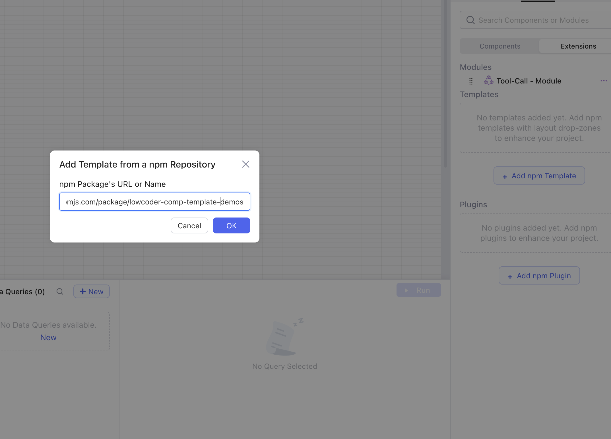
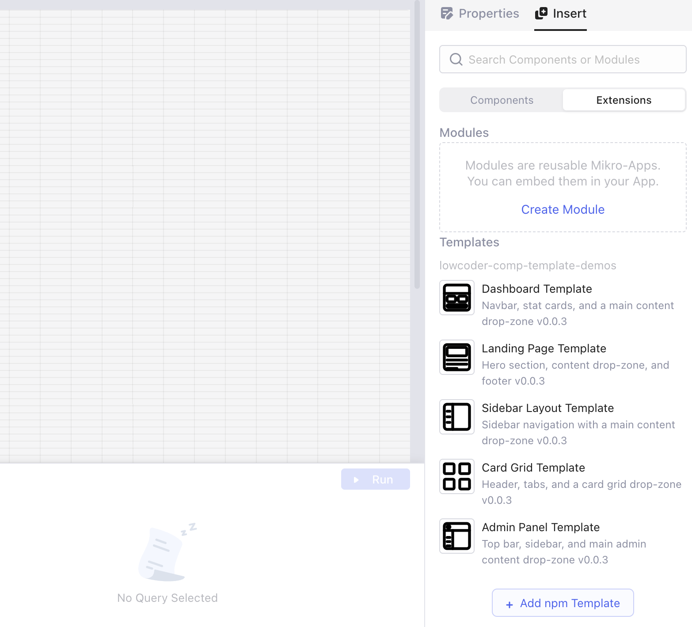
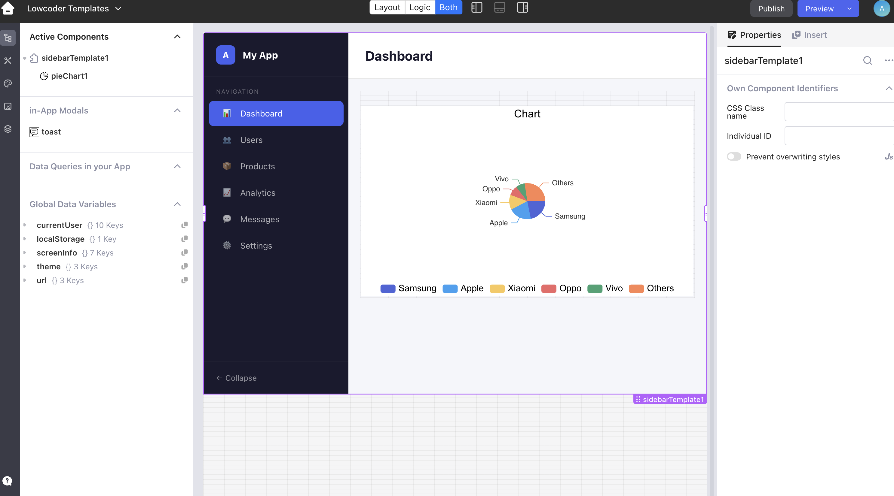

# NPM Template Plugins

NPM Template Plugins let developers package reusable Lowcoder layouts as npm packages. Lowcoder users can add those packages from the editor, drag a prepared layout onto the canvas, and then place normal Lowcoder components into the editable areas of that layout.

## Why this feature exists

Complex layouts can already be created directly inside Lowcoder. For many apps, that is still the right approach. The problem starts when the same layout needs to be reused often and contains many fixed structural parts, such as sidebars, headers, tab areas, dashboard shells, card grids, landing pages, or admin panels.

Building those structures natively in Lowcoder can require a lot of nested containers and repeated layout setup. Over time, that can make the app harder to maintain, harder to copy between apps, and heavier for the editor and runtime.

NPM Template Plugins solve this by moving the fixed layout structure into a developer-maintained npm package. The package provides the layout shell, while Lowcoder keeps the important editable parts available as drop-zones. Users still build visually in Lowcoder, but they start from a prepared structure instead of rebuilding the same nested layout every time.

In short:

- Developers prepare and publish reusable layout packages.
- Lowcoder users install those packages from the editor.
- The fixed layout comes from the package.
- The editable areas remain available as Lowcoder drop-zones.

## Templates vs npm component plugins

Both npm component plugins and npm template plugins are installed from npm, but they solve different problems.


| Type                 | Use it for                                                                           |
| -------------------- | ------------------------------------------------------------------------------------ |
| NPM Component Plugin | Adding one custom component, such as a chart, widget, map, viewer, or input control. |
| NPM Template Plugin  | Adding a reusable page or section layout that contains editable Lowcoder drop-zones. |


Use a template plugin when the main value is the layout structure. Use a component plugin when the main value is a single reusable component.

## For Lowcoder users

### What you need

Before adding a template package, you need:

- the npm package name or npm package URL
- access to the Lowcoder workspace where the package should be available
- private npm registry settings, if the package is not published publicly

For testing, you can use the demo package:

```text
lowcoder-comp-template-demos
```

### Add a template package

1. Open your app in the Lowcoder editor.
2. Go to **Insert > Extensions**.
3. Find the **Templates** section.
4. Click **Add npm Template**.
5. Enter the npm package name or URL.
6. Confirm the dialog.

<figure><figcaption><p>Add an npm template package from the Extensions panel.</p></figcaption></figure>

Lowcoder stores the package in the workspace settings, so the templates can be reused by apps in the same workspace.

### Choose a template

After the package loads, Lowcoder shows the available template designs under the package name. Drag the template you want onto the canvas.

<figure><figcaption><p>Template designs exposed by the installed npm package.</p></figcaption></figure>

The demo package includes layouts such as dashboard, landing page, sidebar, card grid, and admin panel templates.

### Use the drop-zones

The template package provides the fixed layout. The drop-zones are the editable areas where you add Lowcoder components such as tables, charts, forms, buttons, containers, and custom components.

<figure><figcaption><p>Add Lowcoder components inside the template drop-zone.</p></figcaption></figure>

Components inside a drop-zone work like normal Lowcoder components. You can configure them, bind queries, connect data, and style them as usual.

## For template plugin developers

Template plugin developers create the npm package that Lowcoder users install. The reference implementation uses React, TypeScript, Vite, `lowcoder-sdk`, and `lowcoder-cli`, but the idea is not limited to React as a design choice. A developer can use another UI technology if the final package is compatible with Lowcoder's plugin loading model and exposes the required Lowcoder component/container behavior.

For most teams, React is still the recommended path because the Lowcoder SDK examples and the current template demo are React-based.

Developers should prepare:

- a reusable layout shell, such as a dashboard, portal, landing page, sidebar layout, or admin panel
- one or more editable drop-zones where users can place Lowcoder components
- template names, descriptions, and icons for the editor
- `package.json` metadata under `lowcoder.comps`
- an export map from `src/index.ts`
- an npm package published publicly or available through a configured private registry

The reference implementation is available in the Lowcoder component plugin examples:

```text
lowcoder-create-component-plugin/lowcoder-comp-templates-demo/lowcoder-templates/
```

The published demo package is:

```text
lowcoder-comp-template-demos
```

## Development model

A template package usually has two parts:


| Part         | Responsibility                                                                                                                            |
| ------------ | ----------------------------------------------------------------------------------------------------------------------------------------- |
| Fixed layout | Built by the developer in the package. This can include navigation, headers, sidebars, cards, tabs, static sections, and other structure. |
| Drop-zones   | Editable Lowcoder areas where users can drag components and continue building visually.                                                   |


The important rule is to keep the layout shell in code and expose only the parts that should remain editable as Lowcoder drop-zones. This avoids forcing users to manage a deeply nested native Lowcoder layout while still giving them control over the business-specific parts of the app.

## Package registration

Lowcoder discovers templates from the `lowcoder.comps` section in `package.json`.

Example:

```json
{
  "name": "my-template-package",
  "version": "0.1.0",
  "lowcoder": {
    "description": "Reusable Lowcoder layout templates",
    "comps": {
      "dashboardTemplate": {
        "name": "Dashboard Template",
        "icon": "./icons/dashboard.svg",
        "description": "Dashboard layout with a main content drop-zone",
        "isContainer": true,
        "layoutInfo": {
          "w": 24,
          "h": 80,
          "delayCollision": true
        }
      }
    }
  }
}
```

Important fields:


| Field         | Purpose                                                  |
| ------------- | -------------------------------------------------------- |
| `name`        | The template name shown to Lowcoder users.               |
| `icon`        | The icon shown in the Templates list.                    |
| `description` | A short explanation of the layout.                       |
| `isContainer` | Required when the template contains editable drop-zones. |
| `layoutInfo`  | Default canvas size and placement behavior.              |


The key inside `lowcoder.comps`, for example `dashboardTemplate`, must match the component export in `src/index.ts`.

Example:

```ts
import DashboardTemplateComp from "./templates/dashboard/DashboardTemplateComp";

export default {
  dashboardTemplate: DashboardTemplateComp,
};
```

## Developer checklist

Before publishing a template package, check that:

- each template has a clear name, description, and icon
- each editable area is implemented as a Lowcoder drop-zone
- templates with drop-zones are marked with `"isContainer": true`
- every `lowcoder.comps` key is exported from `src/index.ts`
- the package builds successfully with the Lowcoder plugin build flow
- the package is published to npm or available from the configured private registry
- users know which package name or URL to add in Lowcoder
